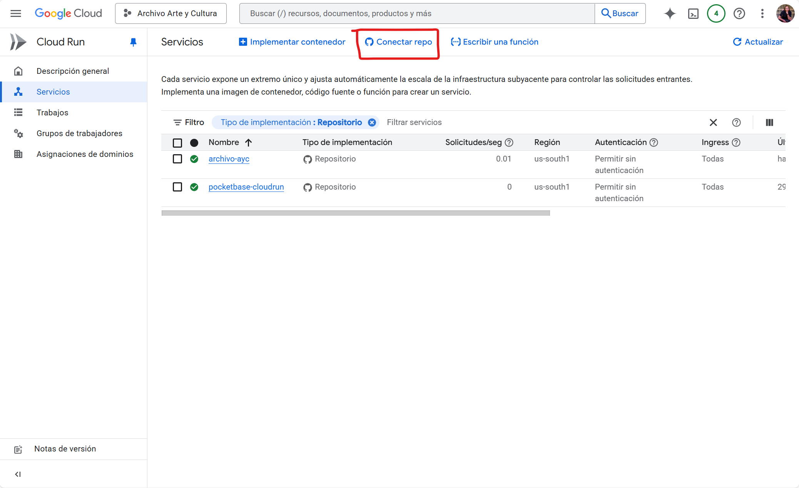
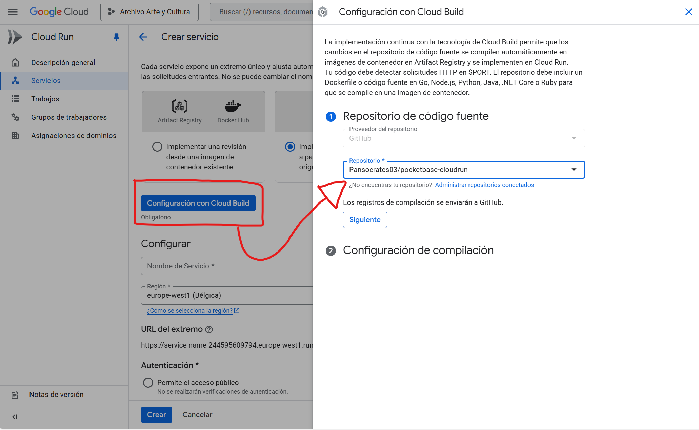
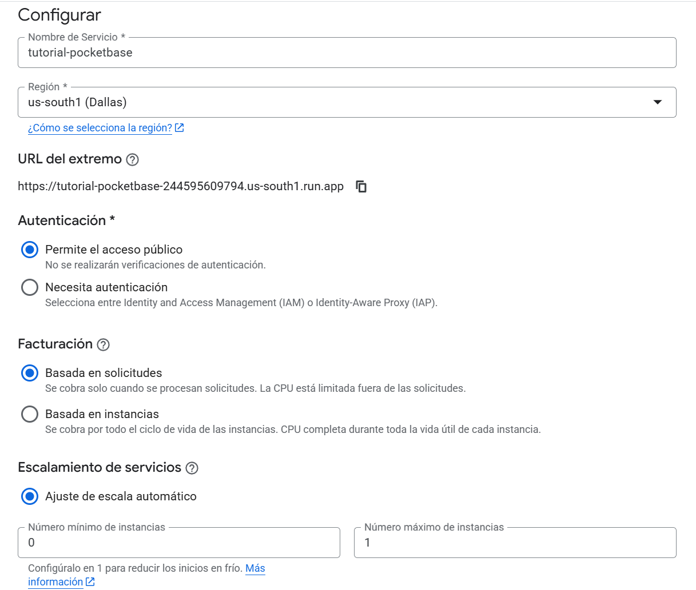
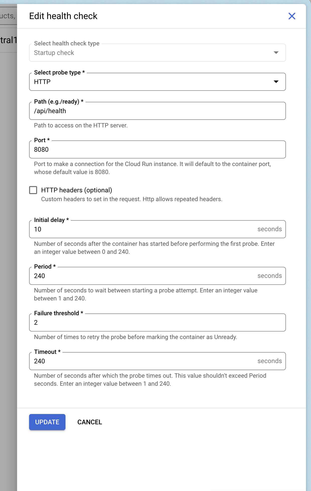
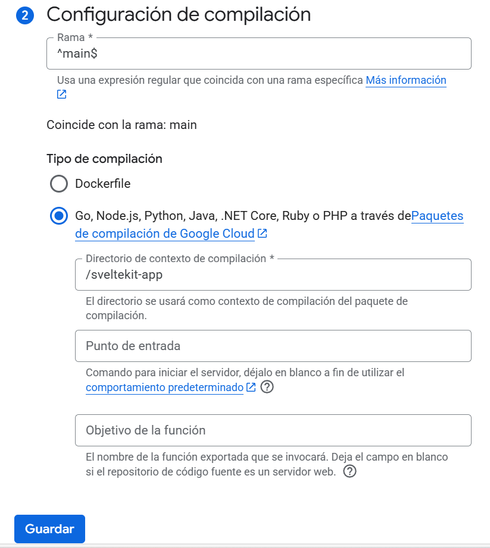

# Tutorial de Instalación
Este documento busca guiar la instalación de el archivo de arte y cultura para un inicio desde cero, así como el uso de la copia de seguridad. Los servicios que se instalarán son:

1. Backend: Base de datos y rest API hecho con Pocketbase
2. Frontend: Página web hecha con Svelte
3. Storage: Sistema de almacenamiento de archivos donde se guardarán las imágenes, programas de mano, entre otros.

Los sistemas que se usarán para la configuración estarán basados en Google Cloud para tener todo el contro en un único lugar.

El costo de la aplicación al mes debería ser menor a $5 USD, sin embargo es un costo variable que considera el espacio de almacenamiento, y los datos de ingreso y egreso, y el uso de la aplicación.

## Pre-requisitos:
1. Tener una cuenta de [Google Cloud](https://console.google.cloud.com)
2. Crear un proyecto en Google Cloud y asegurarse que esté activo en todo momento.
3. Tener una cuenta de [Github](https://github.com) activa
4. Haber comprado un DNS con Hostinger

## Instalación de la aplicación

### Configuración del Storage
1. Accede al [cloud storage](https://console.cloud.google.com/storage)
2. Crea un nuevo Bucket con la siguiente configuración
    - Nombre: archivo-ayc-datos
    - Ubicación (northamerica-south1)
    - Acceso público
3. Crea un segundo bucket con la siguiente configuración
    - Nombre: archivo-ayc-archivos
    - Ubicación (northamerica-south1)
    - Acceso público

> Es importante hacer uso de dos buckets. El primer bucket (datos) se guardarán los datos de la base de datos como obras, nombres, etc. En el segundo (archivos) únicamente se guardarán los archivos e imágenes de la aplicación. De esta forma, en caso de generar una copia de seguridad no se tendrán que copiar todos los archivos diréctamente

### Configuración del Backend
1. Desde tu cuenta de github hacer un *Fork* de este [repositorio](https://github.com/rodydavis/pocketbase-cloudrun)
    - En esta página el botón de Fork se encuentra arriba a la derecha.
    - Asegurarse de que sea la version 0.30.0
1. Entrar al [Cloud Run](https://console.cloud.google.com/run)
2. Haz click en el botón "Conectar repo"

3. Haz click en el botón `Configuración con Cloud Build` y selecciona el repositorio al que acabas de hacer *Fork* 

4. Haz click en `Siguiente` y en la sección `Configuración de Compilación` asegúrate que el tipo de compilación sea `/Dockerfile`
5. Configuraciones generales:
    1. Nombre del servicio: archivo-ayc-pocketbase
    2. Region: us-south1
    3. Autenticación: Permite el acceso público
    4. Facturación: Basada en solicitudes
    5. Número máximo de instancias: 1
    6. Ingress: Todos

6. Contenedores, volúmenes, redes y seguridad:
    1. En la sección "volúmenes" haz click en `Agregar un volumen`
    2. Tipo de volumen: Bucket de Cloud Storage
    3. Nombre del volumen (default)
    4. Bucket: Selecciona el bucket recién creado

    

## Configuración de la aplicación
1. Desde tu cuenta de github hacer un *Fork* de este [repositorio](https://github.com/Pansocrates03/archivo-ayc)
2. Entrar al [Cloud Run](https://console.cloud.google.com/run) de Google Cloud.
3. Haz click en `Conectar repo`
4. Haz click en `Configuración con Cloud Build`
5. Selecciona el repositorio de Github llamado `archivo-ayc` y añade la siguiente configuración:

6. Configuraciones generales:
    1. Nombre del servicio: archivo-ayc-sveltekit
    2. Region: us-south1
    3. Autenticación: Permite el acceso público
    4. Facturación: Basada en solicitudes
    5. Número máximo de instancias: 1
    6. Ingress: Todos
7. Haz click en `Crear` y espera mientras se crea la aplicación.

# Configuración del DNS
En esta sección mostraré como configurar el DNS para que el link sea el comprado:

1. En Hostinger ir a la sección DNS
2. Hacer click en redireccionamiento